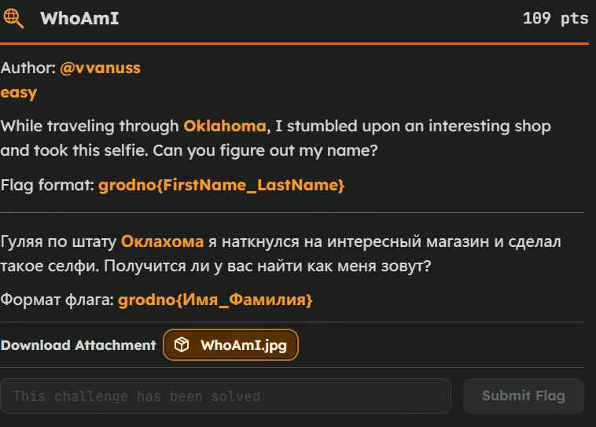
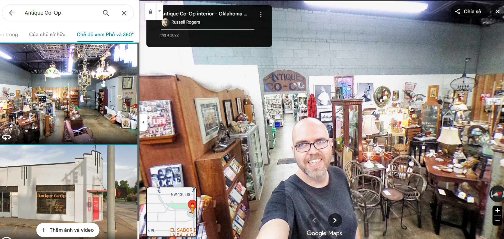

# [Grodno CTF] WhoAmI - Writeup (OSINT)

**Author:** @vvanuss | **Difficulty:** Easy | **Category:** OSINT

---




 **Đây là 1 bài OSINT easy**

## 1. Phân tích đề bài 
Chúng ta có những manh mối như sau:
> **Oklahoma:** Bang Oklahoma ở Mỹ
> **Antique CO-OP:** Bảng tên trong hình ảnh
> ****

Ban đầu tôi đã nghĩ bức tranh này được chụp bởi người trong hình, nên tôi đã dùng exiftool để đọc metadata, nhưng không có manh mối về vị trí của bức ảnh đã được chụp.

Nhưng hình ảnh này được người ra đề lấy trên google 360, nên nó sẽ có trên google map

VỚi 2 manh mối trên chúng ta đã có thể dễ dàng tìm được thông tin của bức ảnh này. 

## 2. Tìm kiếm thông tin

Tôi lên google map search `Antique CO-OP, Oklahoma` thì nó sẽ hiện ngay cửa hàng đầu tiên. Ta vào phần hình ảnh và tìm kiếm chế độ xem 360. 



#### flag: 
```
grodno{Russell_Rogers}
```

#### 3. Bài học rút ra

1. Hãy đọc kĩ đề bài vì rất có thể nó cho chúng ta manh mối để thu hẹp phạm vi tìm kiếm


2. Hãy nhìn, tìm kiếm những manh mối có trong bức ảnh
