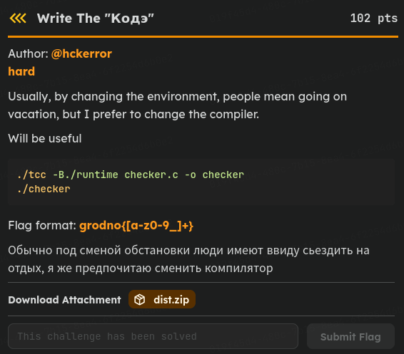

---
> Date: 15/7/2026 :beaver:     
> Owner: Khoi nguyen - Nova:dragon_face:   
> Tools reverse : Ghidra   
> Challenge: Write The "Кодэ" from Junior Crypt 2026 CTF :   
> Target: checker   
> Platform: Linux  
--- 


# Challenge info



Lệnh biên dịch file là `./tcc -B./runtime checker.c -o checker`

# Recon 
- File `checker.c ` đi kèm :
```c
extern int audit(const char *answer);

int main(void)
{
    char answer[128];
    puts("Build provenance check");
    fputs("receipt: ", stdout);
    if (!fgets(answer, sizeof answer, stdin))
        return 1;
    answer[strcspn(answer, "\n")] = 0;
    puts(audit(answer) ? "accepted" : "rejected");
    return 0;
}
```
=> checker này kiểm tra input bằng một hàm có tên là audit, và nó được nhúng vào khi mà biên dịch file 

`file checker`
checker: ELF 64-bit LSB executable, x86-64, version 1 (SYSV), dynamically linked, interpreter /lib64/ld-linux-x86-64.so.2, for GNU/Linux 3.2.0, stripped
=> file có stripped nên file đã bị xóa sysmbol table 

# Analysis static 

Khi mà phân tích ra thì ta thu được mã giả của hàm audit là 

```c
undefined8 audit(char *input) {
  input_ = input;
  key = create_key();
  constant = 0xc0dec0de;
  if (((key != 0) && (len = strlen(input_), len < 0x61)) &&
     (mem = mmap(0x0,0x200,3,0x22,-1,0), mem != 0xffffffffffffffff)) {
    for (i = 0; i < 0x200; i = i + 1) {
      mem_i_ = mem + i;
      mix_data(&key);
      *mem_i_ = (&b4d504758dc45add)[i] ^ extraout_var;
    }
    mprotect(mem,0x200,5);
    l_51 = *mem;
    if (((7 < l_51) && (l_51 < 0x1f5)) && (mem[1] == 'Q')) {
      j = 3;
      for (i = 0; i < l_51; i = i + 1) {
        if (((0x200 < j + 7U) || (*(mem + j) != -0x59)) || (input_[i] == '\0')) goto LAB_004025fd;
        constant = constant ^ input_[i] + *(mem + j + 1);
        lVar1 = j + 3;
        constant = (constant << (*(mem + j + 2) & 0x1f) |constant >> (0x20 - (*(mem + j + 2) & 0x1f) & 0x1f)) +  (i * 0x45d9f3b ^ 0x9e3779b9U);
        lVar2 = j + 4;
        lVar3 = j + 5;
        lVar4 = j + 6;
        j = j + 7;
        if (constant != CONCAT13(*(mem + lVar4),CONCAT12(*(mem + lVar3),CONCAT11(*(mem + lVar2),*(mem + lVar1))) )) goto LAB_004025fd;
      }
      if (input_[l_51] == '\0') {
        munmap(mem,0x200);
        return 1;
      }
    }
LAB_004025fd:
    munmap(mem,0x200);
  }
  return 0;
}

```

Hàm audit này tạo 1 vùng nhớ có độ dài là 512 byte  

Và lấp đầy mem bằng cách :
```c
key = create_key();
  if (((key != 0) && (len = strlen(input_), len < 0x61)) && (mem = mmap(0x0,0x200,3,0x22,-1,0), mem != 0xffffffffffffffff)) {
    for (i = 0; i < 0x200; i = i + 1) {
      mem_i_ = mem + i;
      mix_data(&key);
      *mem_i_ = (&b4d504758dc45add)[i] ^ extraout_var;
    }
```
1.  Tạo 1 khóa và nó có giá trị cố định; 
2. Trộn khóa bằng hàm mix_data
3. Và sau khi trộn xong thì nó sẽ dịch bit:
```c
0040238a e8 81 fe        CALL       mix_data                                         undefined mix_data()
          ff ff
0040238f 48 c1 e8 38     SHR        len,0x38
00402393 48 c1 e0 38     SHL        len,0x38
00402397 48 c1 e8 18     SHR        len,0x18
0040239b 48 c1 e8 20     SHR        len,0x20
```
4. Sau đó nó sẽ xor với một chuỗi cố định tại địa chỉ `&00405b94` có các giá trị là `b4d504758dc45add`

 
Tiếp theo hàm sẽ bắt đầu vòng lặp với  `j = 3 và i = 0 ` chạy tới `l_51`
Khi mà debug bằng gdb thì mình thu được giá trị của `l_51` = `0x33` = `51`   
Và sau khi làm gọn code thì ta có :  
```c
constant = 0xc0dec0de;
j = 3;
for (i = 0; i < 0x33; i = i + 1) {
  if (((0x200 < j + 7) || (mem[j] != -0x59)) || (input_[i] == '\0')) break;
  constant = constant ^ input_[i] + mem[ j + 1 ];
  constant = (constant << ( mem[ j + 2 ] & 0x1f) | constant >> (0x20 - (mem[ j + 2 ] & 0x1f) & 0x1f)) 
  constant +=  (i * 0x45d9f3b ^ 0x9e3779b9);
  constant_en = CONCAT13( mem[ j + 6 ] ,CONCAT12( mem[ j + 5 ] ,CONCAT11( mem[ j + 4 ] , mem[ j + 3 ] ) ) )
  if (constant != constant_en ) break;
   j = j + 7;
}
```
=> vòng lặp này nhằm mục đích biến đổi `input` bằng cách + với `mem[j+1] ` và sau đó  xor với `0xc0dec0de`   
=> tiếp theo nó thực hiện phép xoay trái bit (Rotate Left - ROL) `constant` và + với `(i * 0x45d9f3b ^ 0x9e3779b9);`
=> sau cùng nó sẽ so sánh với 1 constant đã mã hóa được lưu trong `mem`
=> Vậy nếu ta dump được dữ liệu của `mem` và `constant_en` thì là ta sẽ đảo ngược lại được vì các hàng số khi mã hóa `input` nó cố định 
=> chỉ cần debug là chúng ta lấy được flag  :fire:  :fire: :fire: :fire: :fire:

# Analysis static 

Mình sẽ debug bằng `gdb` vì nó là file ELF và chuỗi mà mình sẽ thử sẽ là   
`AAAAAAAAAAAAAAAAAAAAAAAAAAAAAAAAAAAAAAAAAAAAAAAAAA0`  
Một số breakpoint mà mình dùng để hiểu chương trình :

```c
break *0x00402296
  commands
    echo \n--- ham audit ---\n
  end
break *0x004022a5
  commands
    echo \n create key \n
  end
break *0x00402314
  commands
    echo \n Create mem \n 
  end
break *0x00402335
  commands
    echo \n start loot set value mem \n
  end
break *0x004022d0
  commands
    echo \n Check len input 0x61 \n
  end
break *0x004023b0
  commands
    echo \n Finish loot set value mem and we can get value of mem here \n
  end
break *0x004023f0 
  commands 
    echo \n check 7 < uVar \n 
  end
break *0x004024fe
  commands 
    echo \n--- check len mem : (uVar1 < 0x1f5) ----\n
  end
break *0x00402416
  commands
    echo \n--- check mem[1] == 'Q' || 0x51  ---\n 
  end 
break *0x00402429 
  commands 
    echo \n--- start for with j = 3 ---\n 
  end 
break *0x004024a2
  commands 
    echo \n--- check (input_[i] == '\0' | JNZ LAB_004024b0 => true | LAB_004024ab :return 0 ---\n 
  end
break *0x0040243b
  commands 
    echo \n--- for(i=0; i<len(mem);i++) | JNC LAB_004025c3 => out for ---\n 
  end
break *0x004025b1
  commands 
    echo \n cmp constant_en \n 
  end 
```


Và sau khi debug bằng những breakpoint trên thì mình thu được :  
Tại địa chỉ `mem` lưu giá trị:  
```c
pwndbg> x/64gx 0x7ffff7ffa000
Địa chỉ              Giá trị 1           Giá trị 2
0x7ffff7ffa000:	0xfa460131a7510033	0x6590a1087aa71ff4
0x7ffff7ffa010:	0x5f560f810fc3a78f	0xa78f87798b160ca7
0x7ffff7ffa020:	0x9ea7a131f47e1d55	0x0ce7a7b222141205
0x7ffff7ffa030:	0x121330a7a55dcdfd	0xd59c1a79a7ed154e
0x7ffff7ffa040:	0xbd338d02c2a7e08f	0x3007226e090ba73b
0x7ffff7ffa050:	0xa7d105de371054a7	0xe6a7463c926c179d
0x7ffff7ffa060:	0x062fa77885910f1e	0x5d0d78a7c48e2ce1
0x7ffff7ffa070:	0xd77314c1a7a4d6a6	0x9e320a1b0aa753a8
0x7ffff7ffa080:	0xc593e14e0353a7fe	0xa71c4c77ee0a9ca7
0x7ffff7ffa090:	0x2ea7b6d941bd11e5	0x1f77a7f5504faf18
0x7ffff7ffa0a0:	0x7007c0a7f8e4fe67	0xaf680e09a76cdddf
0x7ffff7ffa0b0:	0x41cc0f1552a76eb4	0x2e996f161c9ba7ee
0x7ffff7ffa0c0:	0xa7d57f97d204e4a7	0x76a7e0c482780b2d
0x7ffff7ffa0d0:	0x19bfa7eb3bf32812	0x220108a72ea64937
0x7ffff7ffa0e0:	0x3e4f0851a776adc4	0xd560c60f9aa7c349
0x7ffff7ffa0f0:	0x6b83d1c716e3a7ad	0xa7146c36d11d2ca7
0x7ffff7ffa100:	0xbea790a3e4970575	0x1307a77e1b23480c
0x7ffff7ffa110:	0x771a50a755aecc54	0x62790299a721caf3
0x7ffff7ffa120:	0x90553909e2a7b7c3	0x7f0f19a7102ba7b3
0x7ffff7ffa130:	0xa7e3ce4edc1774a7	0x06a75713bb991ebd
0x7ffff7ffa140:	0x0d4fa71f32847b06	0x581498a7a77ec909
0x7ffff7ffa150:	0x30811be1a7d3d1ba	0xa584dc032aa74659
0x7ffff7ffa160:	0xda8f12390a73a77e	0x0000000000000000
```
Giá trị constant_en 2 lần thử mình thu thập được :
```c
j = 3 :
i = 0x0 < 0x33 

&j = 0x7fffffffdb50
&i = 0x7fffffffdb58 
&input = 0x7fffffffdb90
&mem =0x7fffffffdb70 | mem = 0x7ffff7ffa000
&constant = 0x7fffffffdb4c 

i = 0 
j = 3
=> constant_en = 0x1ff4fa46 

i = 1 
j = 10
=> constant_en = 0x8f6590a1
```

Mình lấy được `constant_en` bằng cách đặt breakpoint tại `0x4025b1` sau đó xem giá trị của thanh ghi `rcx` là ta có thể lấy được giá trị `constant_en`  
Và vì loot tới 51 lẫn nên muốn lấy được thì ta chỉ cần viết script mỗi khi tới breakpoint địa chỉ `0x4025b1` sau đó dump ra giá trị thanh ghi `rcx` và chỉnh giá trị thanh ghi `rax` bằng thanh ghi `rcx` là ta chạy tiếp được (`rax`  là thanh ghi lưu giá trị `constant` mã hóa bằng `input`  )  


Đây là script mình viết để tự động dump ra:  

```python
import gdb

f_flag = open("constant_flag.txt", "w")
f_mem= open("mem.txt","w")


class BP_dump_mem(gdb.Breakpoint):
    def stop(seft):
        inferior = gdb.selected_inferior()
        data = bytes(inferior.read_memory(0x7ffff7ffa000, 0x200))
        print(data)
        for b in data:
            f_mem.write(f"{b:02x}\n")
            f_mem.flush()
        return False  


class BP_dump_j(gdb.Breakpoint):
    def stop(self):
        rax = int(gdb.parse_and_eval("$rax"))
        print(f"j = {rax}")
        return False


class BP_dump_flag_en(gdb.Breakpoint):
    def stop(self):
        rcx = int(gdb.parse_and_eval("$rcx"))
        print(f"{hex(rcx)}")
        f_flag.write(f"{hex(rcx)}\n")
        f_flag.flush()
        gdb.execute(f"set $rax={hex(rcx)}")
        return False 


class BP_debug(gdb.Breakpoint):
    def stop(self):
        print(f"hit 0x004025d1 : Check byte 51 is == 0 ?")
        return True  
  

BP_dump_mem("*0x4023b0")
BP_dump_j("*0x40245e")
BP_dump_flag_en("*0x4025b1")
BP_debug("*0x004025d1")
gdb.execute("run")
```

Sau khi dump được các giá trị của `mem` và `en_constant` thì ta chỉ cần đảo ngược lại thuật toán là ra được :  

```python
with open("constant_flag.txt", "r") as f:
    constant_en = f.readlines()
with open("mem.txt", "r") as f:
    mem = f.readlines()

constant_c0 = 0xc0dec0de
j = 3
flag_str = ""

for i in range(0, 51):
    constant_flag = int(constant_en[i], 16)
    mem_j_2 = int(mem[j + 2], 16)
    rot = mem_j_2 & 0x1f

    constant_origin = (constant_flag - (i * 0x45d9f3b ^ 0x9e3779b9)) & 0xffffffff
    constant_origin = (constant_origin >> rot | constant_origin << (0x20 - rot)) & 0xffffffff

    flag = (constant_origin ^ constant_c0) - int(mem[j + 1], 16)
    flag &= 0xff                    

    flag_str += chr(flag)

    constant_c0 = constant_flag
    j += 7

print(flag_str)
```
khi chạy ta thu được `grodno{Fabrice_Bellard_is_a_really_cool_programmer}`
